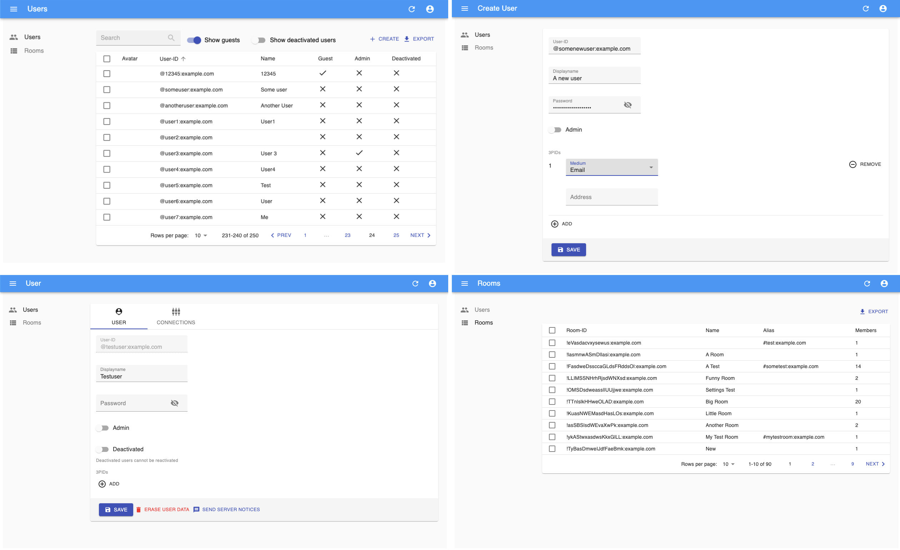

# Synapse Admin UI [](https://github.com/Awesome-Technologies/synapse-admin/blob/master/LICENSE)



This project is built using [react-admin](https://marmelab.com/react-admin/).

<!-- vim-markdown-toc GFM -->

* [Fork differences](#fork-differences)
  * [Available via CDN](#available-via-cdn)
  * [Changes](#changes)
  * [Development](#development)
* [Configuration](#configuration)
  * [Restricting available homeserver](#restricting-available-homeserver)
  * [Protecting appservice managed users](#protecting-appservice-managed-users)
  * [Providing support URL](#providing-support-url)
* [Usage](#usage)
  * [Supported Synapse](#supported-synapse)
  * [Prerequisites](#prerequisites)
  * [Use without install](#use-without-install)
  * [Step-By-Step install](#step-by-step-install)
    * [Steps for 1)](#steps-for-1)
    * [Steps for 2)](#steps-for-2)
    * [Steps for 3)](#steps-for-3)
  * [Serving Synapse-Admin on a different path](#serving-synapse-admin-on-a-different-path)
* [Development](#development-1)

<!-- vim-markdown-toc -->

## Fork differences

With [Awesome-Technologies/synapse-admin](https://github.com/Awesome-Technologies/synapse-admin) as the upstream, this
fork is intended to be a more feature-rich version of the original project. The main goal is to provide a more
user-friendly interface for managing Synapse homeservers.

### Available via CDN

On [admin.etke.cc](https://admin.etke.cc) you can find the latest version of this fork.

### Changes

The following changes are already implemented:

* [Prevent admins from deleting themselves](https://github.com/etkecc/synapse-admin/pull/1)
* [Fix user's default tab not being shown](https://github.com/etkecc/synapse-admin/pull/8)
* [Add identifier when authorizing with password](https://github.com/Awesome-Technologies/synapse-admin/pull/601)
* [Add ability to toggle whether to show locked users](https://github.com/Awesome-Technologies/synapse-admin/pull/573)
* [Fix user's display name in header on user's page](https://github.com/etkecc/synapse-admin/pull/9)
* [Fix footer overlapping content](https://github.com/Awesome-Technologies/synapse-admin/issues/574)
* Switch from nginx to [SWS](https://static-web-server.net/) for serving the app, reducing the size of the Docker image
* [Fix redirect URL after user creation](https://github.com/etkecc/synapse-admin/pull/16)
* [Display actual Synapse errors](https://github.com/etkecc/synapse-admin/pull/17)
* [Fix base_url being undefined on unsuccessful login](https://github.com/etkecc/synapse-admin/pull/18)
* [Put the version into manifest.json](https://github.com/Awesome-Technologies/synapse-admin/issues/507) (CI only)
* [Federation page improvements](https://github.com/Awesome-Technologies/synapse-admin/pull/583) (using theme colors)
* [Add UI option to block deleted rooms from being rejoined](https://github.com/etkecc/synapse-admin/pull/26)
* [Fix required fields check on Bulk registration CSV upload](https://github.com/etkecc/synapse-admin/pull/32)
* [Fix requests with invalid MXIDs on Bulk registration](https://github.com/etkecc/synapse-admin/pull/33)
* [Expose user avatar URL field in the UI](https://github.com/etkecc/synapse-admin/pull/27)
* [Upgrade react-admin to v5](https://github.com/etkecc/synapse-admin/pull/40)
* [Restrict actions on specific users](https://github.com/etkecc/synapse-admin/pull/42)
* [Add `Contact support` menu item](https://github.com/etkecc/synapse-admin/pull/45)
* [Provide options to delete media and redact events on user erase](https://github.com/etkecc/synapse-admin/pull/49)
* [Authenticated Media support](https://github.com/etkecc/synapse-admin/pull/51)
* [Better media preview/download](https://github.com/etkecc/synapse-admin/pull/53)

_the list will be updated as new changes are added_

### Development

`just run-dev` to start the development stack (depending on your system speed, you may want to re-run this command if
   user creation fails)

After that open `http://localhost:5173` in your browser, login using the following credentials:

* Login: admin
* Password: admin
* Homeserver URL: http://localhost:8008

## Configuration

You can use `config.json` file to configure synapse-admin

The `config.json` can be injected into a Docker container using a bind mount.

```yml
services:
  synapse-admin:
    ...
    volumes:
      ./config.json:/app/config.json:ro
    ...
```

### Restricting available homeserver

You can restrict the homeserver(s), so that the user can no longer define it himself.

Edit `config.json` to restrict either to a single homeserver:

```json
{
  "restrictBaseUrl": "https://your-matrixs-erver.example.com"
}
```

or to a list of homeservers:

```json
{
  "restrictBaseUrl": ["https://your-first-matrix-server.example.com", "https://your-second-matrix-server.example.com"]
}
```

### Protecting appservice managed users

To avoid accidental adjustments of appservice-managed users (e.g., puppets created by a bridge) and breaking the bridge,
you can specify the list of MXIDs (regexp) that should be prohibited from any changes, except display name and avatar.

Example for [mautrix-telegram](https://github.com/mautrix/telegram)

```json
{
  "asManagedUsers": ["^@telegram_[a-zA-Z0-9]+:example\\.com$"]
}
```

### Providing support URL

Synapse-Admin provides a support link in the main menu - `Contact support`. By default, the link points to the GitHub issues page of the project. You can change this link by providing a `supportURL` in the `config.json`.

```json
{
  "supportURL": "https://example.com/support"
}
```

## Usage

### Supported Synapse

It needs at least [Synapse](https://github.com/element-hq/synapse) v1.116.0 for all functions to work as expected!

You get your server version with the request `/_synapse/admin/v1/server_version`.
See also [Synapse version API](https://element-hq.github.io/synapse/latest/admin_api/version_api.html).

After entering the URL on the login page of synapse-admin the server version appears below the input field.

### Prerequisites

You need access to the following endpoints:

- `/_matrix`
- `/_synapse/admin`

See also [Synapse administration endpoints](https://element-hq.github.io/synapse/latest/reverse_proxy.html#synapse-administration-endpoints)

### Use without install

You can use the current version of Synapse Admin without own installation direct
via [admin.etke.cc](https://admin.etke.cc).

**Note:**
If you want to use the deployment, you have to make sure that the admin endpoints (`/_synapse/admin`) are accessible for your browser.
**Remember: You have no need to expose these endpoints to the internet but to your network.**
If you want your own deployment, follow the [Step-By-Step Install Guide](#step-by-step-install) below.

### Step-By-Step install

You have three options:

1.  [Download the tarball and serve with any webserver](#steps-for-1)
2.  [Download the source code from github and run using nodejs](#steps-for-2)
3.  [Run the Docker container](#steps-for-3)

#### Steps for 1)

- make sure you have a webserver installed that can serve static files (any webserver like nginx or apache will do)
- configure a vhost for synapse admin on your webserver
- download the .tar.gz [from the latest release](https://github.com/etkecc/synapse-admin/releases/latest)
- unpack the .tar.gz
- move or symlink the `synapse-admin` into your vhosts root dir
- open the url of the vhost in your browser

#### Steps for 2)

- make sure you have installed the following: git, yarn, nodejs
- download the source code: `git clone https://github.com/etkecc/synapse-admin.git`
- change into downloaded directory: `cd synapse-admin`
- download dependencies: `yarn install`
- start web server: `yarn start`

#### Steps for 3)

- run the Docker container from the public docker registry: `docker run -p 8080:80 ghcr.io/etkecc/synapse-admin` or use the [docker-compose.yml](docker-compose.yml): `docker-compose up -d`

  > note: if you're building on an architecture other than amd64 (for example a raspberry pi), make sure to define a maximum ram for node. otherwise the build will fail.

  ```yml
  services:
    synapse-admin:
      container_name: synapse-admin
      hostname: synapse-admin
      build:
        context: https://github.com/etkecc/synapse-admin.git
        args:
          - BUILDKIT_CONTEXT_KEEP_GIT_DIR=1
        #   - NODE_OPTIONS="--max_old_space_size=1024"
        #   - BASE_PATH="/synapse-admin"
      ports:
        - "8080:80"
      restart: unless-stopped
  ```

- browse to http://localhost:8080

### Serving Synapse-Admin on a different path

The path prefix where synapse-admin is served can only be changed during the build step.

If you downloaded the source code, use `yarn build --base=/my-prefix` to set a path prefix.

If you want to build your own Docker container, use the `BASE_PATH` argument.

We do not support directly changing the path where Synapse-Admin is served in the pre-built Docker container. Instead please use a reverse proxy if you need to move Synapse-Admin to a different base path. If you want to serve multiple applications with different paths on the same domain, you need a reverse proxy anyway.

Example for Traefik:

`docker-compose.yml`

```yml
services:
  traefik:
    image: traefik:mimolette
    restart: unless-stopped
    ports:
      - 80:80
      - 443:443
    volumes:
      - /var/run/docker.sock:/var/run/docker.sock:ro

  synapse-admin:
    image: etkecc/synapse-admin:latest
    restart: unless-stopped
    labels:
      - "traefik.enable=true"
      - "traefik.http.routers.synapse-admin.rule=Host(`example.com`)&&PathPrefix(`/admin`)"
      - "traefik.http.routers.synapse-admin.middlewares=admin,admin_path"
      - "traefik.http.middlewares.admin.redirectregex.regex=^(.*)/admin/?"
      - "traefik.http.middlewares.admin.redirectregex.replacement=$${1}/admin/"
      - "traefik.http.middlewares.admin_path.stripprefix.prefixes=/admin"
```

## Development

- See https://yarnpkg.com/getting-started/editor-sdks how to setup your IDE
- Use `yarn lint` to run all style and linter checks
- Use `yarn test` to run all unit tests
- Use `yarn fix` to fix the coding style
